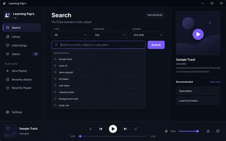

# Learning Pap’s

A lightweight Windows music player built around YouTube playback, designed to feel closer to a clean desktop music app than a full browser tab.

## Version 1.0

Learning Pap’s 1.0 is the first public release.

## Screenshots

### Search

### Album / Playlist View

### Library

### Highlights

- Fast in-app YouTube search
- Search filters for songs, albums & EPs, artists, playlists, videos, duration, and upload date
- Live search suggestions with recent-search history
- Library, Likes, playlists, Queue, Recently Added, and Recently Played
- Album and playlist detail views with full track lists
- Shuffle, Repeat, Queue All, and Add All to Playlist
- Clickable uploader/channel names for related recommendations
- Song publish date and compact view-count display
- Expandable comments loaded in batches
- Gaming Mode with automatic game detection and reduced background work
- Backup / Restore codes for local app data
- Single-instance Windows app
- Minimize-to-tray playback

## Installation

1. Download **Learning Paps Setup.exe** from the latest GitHub Release.
2. Run the installer.
3. Follow the setup prompts.
4. Launch **Learning Pap’s** from the Start Menu or desktop shortcut if selected during installation.

Windows may show a SmartScreen warning for unsigned indie software. If you downloaded the installer directly from this repository's Releases page, verify that the file name and release version match before running it.

## How playback works

Learning Pap’s uses embedded YouTube playback. Music is streamed from YouTube rather than downloaded or stored locally.

## Local data

Your Library, Likes, playlists, queue/history, search history, and settings are stored locally on your PC. The Settings page also includes Backup / Restore codes so you can preserve or move that data.

## Gaming Mode

Gaming Mode keeps core playback and search available while reducing nonessential background work such as recommendations, comments, animations, and frequent UI polling.

## Notes

- Internet access is required for search and playback.
- YouTube availability, metadata, comments, and individual videos can change independently of Learning Pap’s.
- Learning Pap’s is not affiliated with or endorsed by YouTube or Google.

## Release

Current public version: **1.0**
